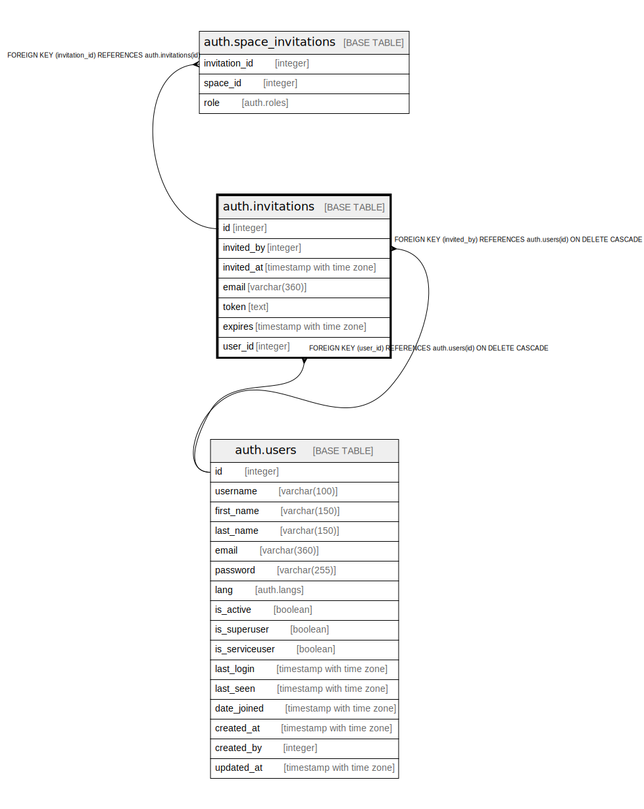

# auth.invitations

## Description

## Columns

| Name | Type | Default | Nullable | Children | Parents | Comment |
| ---- | ---- | ------- | -------- | -------- | ------- | ------- |
| id | integer | nextval('auth.invitations_id_seq'::regclass) | false | [auth.space_invitations](auth.space_invitations.md) |  |  |
| invited_by | integer |  | true |  | [auth.users](auth.users.md) |  |
| invited_at | timestamp with time zone | now() | true |  |  |  |
| email | varchar(360) | NULL::character varying | true |  |  |  |
| token | text |  | true |  |  |  |
| expires | timestamp with time zone | (CURRENT_TIMESTAMP + '7 days'::interval) | true |  |  |  |
| user_id | integer |  | true |  | [auth.users](auth.users.md) |  |

## Constraints

| Name | Type | Definition |
| ---- | ---- | ---------- |
| fk_invited_by | FOREIGN KEY | FOREIGN KEY (invited_by) REFERENCES auth.users(id) ON DELETE CASCADE |
| fk_user_id | FOREIGN KEY | FOREIGN KEY (user_id) REFERENCES auth.users(id) ON DELETE CASCADE |
| invitations_pkey | PRIMARY KEY | PRIMARY KEY (id) |

## Indexes

| Name | Definition |
| ---- | ---------- |
| invitations_pkey | CREATE UNIQUE INDEX invitations_pkey ON auth.invitations USING btree (id) |
| invitations_invited_by_index | CREATE INDEX invitations_invited_by_index ON auth.invitations USING btree (invited_by) |
| invitations_email_index | CREATE INDEX invitations_email_index ON auth.invitations USING btree (email) |
| invitations_token_index | CREATE INDEX invitations_token_index ON auth.invitations USING btree (token) |
| invitations_user_id_index | CREATE INDEX invitations_user_id_index ON auth.invitations USING btree (user_id) |

## Relations

---

> Generated by [tbls](https://github.com/k1LoW/tbls)
