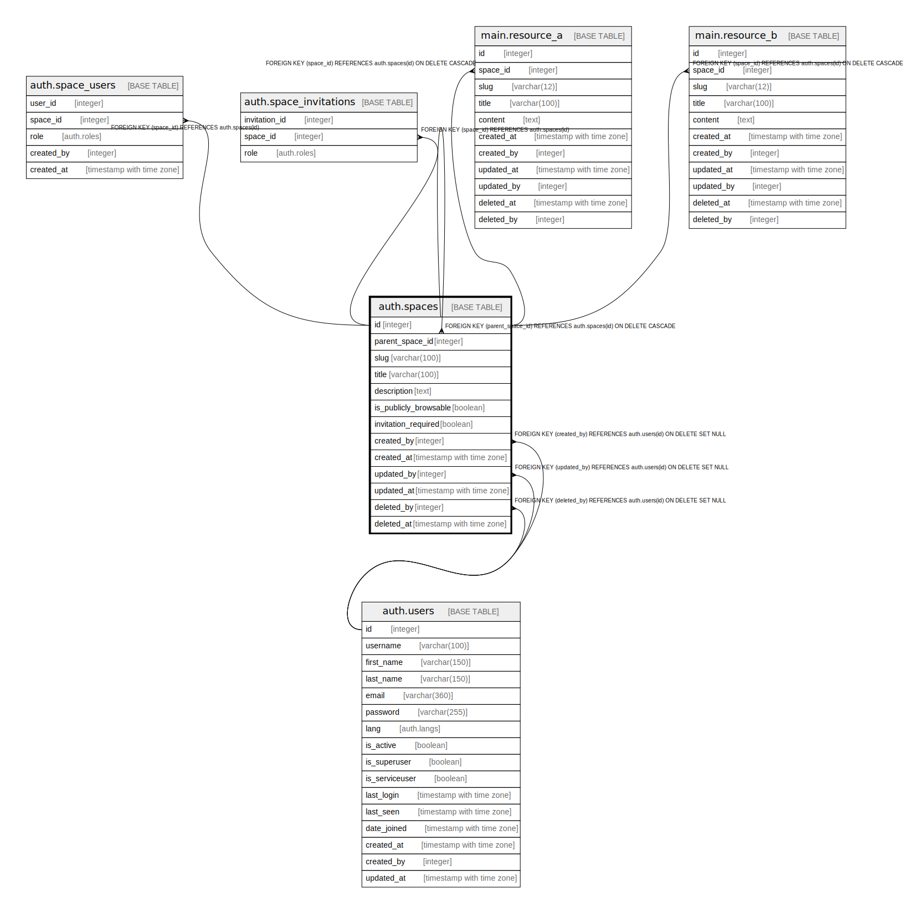

# auth.spaces

## Description

## Columns

| Name | Type | Default | Nullable | Children | Parents | Comment |
| ---- | ---- | ------- | -------- | -------- | ------- | ------- |
| id | integer | nextval('auth.spaces_id_seq'::regclass) | false | [auth.spaces](auth.spaces.md) [auth.space_users](auth.space_users.md) [auth.space_invitations](auth.space_invitations.md) [main.resource_a](main.resource_a.md) [main.resource_b](main.resource_b.md) |  |  |
| parent_space_id | integer |  | true |  | [auth.spaces](auth.spaces.md) |  |
| slug | varchar(100) |  | false |  |  |  |
| title | varchar(100) |  | false |  |  |  |
| description | text |  | true |  |  |  |
| is_publicly_browsable | boolean | false | true |  |  |  |
| invitation_required | boolean | true | true |  |  |  |
| created_by | integer | (NULLIF(current_setting('auth.user_id'::text, true), ''::text))::integer | true |  | [auth.users](auth.users.md) |  |
| created_at | timestamp with time zone | now() | true |  |  |  |
| updated_by | integer |  | true |  | [auth.users](auth.users.md) |  |
| updated_at | timestamp with time zone | now() | true |  |  |  |
| deleted_by | integer |  | true |  | [auth.users](auth.users.md) |  |
| deleted_at | timestamp with time zone |  | true |  |  |  |

## Constraints

| Name | Type | Definition |
| ---- | ---- | ---------- |
| spaces_created_by_fkey | FOREIGN KEY | FOREIGN KEY (created_by) REFERENCES auth.users(id) ON DELETE SET NULL |
| spaces_deleted_by_fkey | FOREIGN KEY | FOREIGN KEY (deleted_by) REFERENCES auth.users(id) ON DELETE SET NULL |
| spaces_updated_by_fkey | FOREIGN KEY | FOREIGN KEY (updated_by) REFERENCES auth.users(id) ON DELETE SET NULL |
| spaces_parent_space_id_fkey | FOREIGN KEY | FOREIGN KEY (parent_space_id) REFERENCES auth.spaces(id) ON DELETE CASCADE |
| spaces_pkey | PRIMARY KEY | PRIMARY KEY (id) |

## Indexes

| Name | Definition |
| ---- | ---------- |
| spaces_pkey | CREATE UNIQUE INDEX spaces_pkey ON auth.spaces USING btree (id) |
| spaces_parent_space_id_index | CREATE INDEX spaces_parent_space_id_index ON auth.spaces USING btree (parent_space_id) |
| spaces_slug_index | CREATE INDEX spaces_slug_index ON auth.spaces USING btree (slug) |
| spaces_is_publicly_browsable_index | CREATE INDEX spaces_is_publicly_browsable_index ON auth.spaces USING btree (is_publicly_browsable) |
| spaces_created_by_index | CREATE INDEX spaces_created_by_index ON auth.spaces USING btree (created_by) |
| spaces_created_at_index | CREATE INDEX spaces_created_at_index ON auth.spaces USING btree (created_at) |
| spaces_updated_by_index | CREATE INDEX spaces_updated_by_index ON auth.spaces USING btree (updated_by) |
| spaces_updated_at_index | CREATE INDEX spaces_updated_at_index ON auth.spaces USING btree (updated_at) |
| spaces_deleted_by_index | CREATE INDEX spaces_deleted_by_index ON auth.spaces USING btree (deleted_by) |
| spaces_deleted_at_index | CREATE INDEX spaces_deleted_at_index ON auth.spaces USING btree (deleted_at) |

## Triggers

| Name | Definition |
| ---- | ---------- |
| space_after_insert | CREATE TRIGGER space_after_insert AFTER INSERT ON auth.spaces FOR EACH ROW EXECUTE FUNCTION auth.space_after_insert_row() |

## Relations

---

> Generated by [tbls](https://github.com/k1LoW/tbls)
