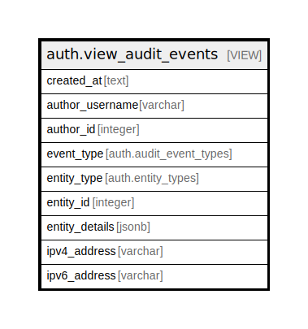

# auth.view_audit_events

## Description

<details>
<summary><strong>Table Definition</strong></summary>

```sql
CREATE VIEW view_audit_events AS (
 SELECT to_char(audit_events.created_at, 'YYYY-MM-dd HH24:MI:SS'::text) AS created_at,
        CASE
            WHEN (users.username IS NULL) THEN 'Anonymous'::character varying
            ELSE users.username
        END AS author_username,
    audit_events.author_id,
    audit_events.event_type,
    audit_events.entity_type,
    audit_events.entity_id,
    auth.get_entity_details(audit_events.entity_type, audit_events.entity_id) AS entity_details,
    audit_events.ipv4_address,
    audit_events.ipv6_address
   FROM (auth.audit_events
     LEFT JOIN auth.users ON ((audit_events.author_id = users.id)))
  ORDER BY (to_char(audit_events.created_at, 'YYYY-MM-dd HH24:MI:SS'::text)) DESC
)
```

</details>

## Referenced Tables

- [auth.audit_events](auth.audit_events.md)
- [auth.users](auth.users.md)

## Columns

| Name | Type | Default | Nullable | Children | Parents | Comment |
| ---- | ---- | ------- | -------- | -------- | ------- | ------- |
| created_at | text |  | true |  |  |  |
| author_username | varchar |  | true |  |  |  |
| author_id | integer |  | true |  |  |  |
| event_type | auth.audit_event_types |  | true |  |  |  |
| entity_type | auth.entity_types |  | true |  |  |  |
| entity_id | integer |  | true |  |  |  |
| entity_details | jsonb |  | true |  |  |  |
| ipv4_address | varchar |  | true |  |  |  |
| ipv6_address | varchar |  | true |  |  |  |

## Relations



---

> Generated by [tbls](https://github.com/k1LoW/tbls)
