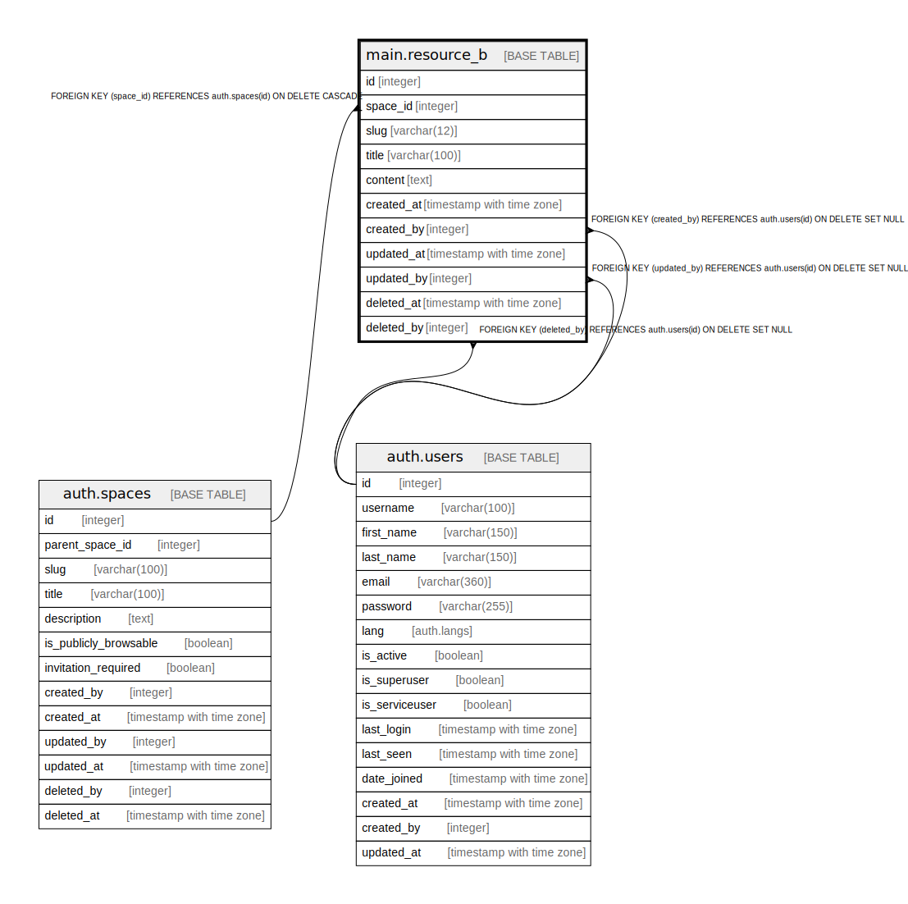

# main.resource_b

## Description

## Columns

| Name | Type | Default | Nullable | Children | Parents | Comment |
| ---- | ---- | ------- | -------- | -------- | ------- | ------- |
| id | integer | nextval('main.resource_b_id_seq'::regclass) | false |  |  |  |
| space_id | integer |  | false |  | [auth.spaces](auth.spaces.md) |  |
| slug | varchar(12) |  | false |  |  |  |
| title | varchar(100) |  | false |  |  |  |
| content | text |  | false |  |  |  |
| created_at | timestamp with time zone | now() | true |  |  |  |
| created_by | integer | (NULLIF(current_setting('auth.user_id'::text, true), ''::text))::integer | true |  | [auth.users](auth.users.md) |  |
| updated_at | timestamp with time zone | now() | true |  |  |  |
| updated_by | integer |  | true |  | [auth.users](auth.users.md) |  |
| deleted_at | timestamp with time zone | now() | true |  |  |  |
| deleted_by | integer |  | true |  | [auth.users](auth.users.md) |  |

## Constraints

| Name | Type | Definition |
| ---- | ---- | ---------- |
| resource_b_created_by_fkey | FOREIGN KEY | FOREIGN KEY (created_by) REFERENCES auth.users(id) ON DELETE SET NULL |
| resource_b_deleted_by_fkey | FOREIGN KEY | FOREIGN KEY (deleted_by) REFERENCES auth.users(id) ON DELETE SET NULL |
| resource_b_updated_by_fkey | FOREIGN KEY | FOREIGN KEY (updated_by) REFERENCES auth.users(id) ON DELETE SET NULL |
| fk_space_id | FOREIGN KEY | FOREIGN KEY (space_id) REFERENCES auth.spaces(id) ON DELETE CASCADE |
| resource_b_pkey | PRIMARY KEY | PRIMARY KEY (id) |

## Indexes

| Name | Definition |
| ---- | ---------- |
| resource_b_pkey | CREATE UNIQUE INDEX resource_b_pkey ON main.resource_b USING btree (id) |
| resource_b_space_id_index | CREATE INDEX resource_b_space_id_index ON main.resource_b USING btree (space_id) |
| resource_b_slug_index | CREATE INDEX resource_b_slug_index ON main.resource_b USING btree (slug) |
| resource_b_created_at_index | CREATE INDEX resource_b_created_at_index ON main.resource_b USING btree (created_at) |
| resource_b_created_by_index | CREATE INDEX resource_b_created_by_index ON main.resource_b USING btree (created_by) |
| resource_b_updated_at_index | CREATE INDEX resource_b_updated_at_index ON main.resource_b USING btree (updated_at) |
| resource_b_updated_by_index | CREATE INDEX resource_b_updated_by_index ON main.resource_b USING btree (updated_by) |
| resource_b_deleted_at_index | CREATE INDEX resource_b_deleted_at_index ON main.resource_b USING btree (deleted_at) |
| resource_b_deleted_by_index | CREATE INDEX resource_b_deleted_by_index ON main.resource_b USING btree (deleted_by) |

## Triggers

| Name | Definition |
| ---- | ---------- |
| resource_b_after_insert | CREATE TRIGGER resource_b_after_insert AFTER INSERT ON main.resource_b FOR EACH ROW EXECUTE FUNCTION main.resource_b_after_insert_row() |

## Relations

---

> Generated by [tbls](https://github.com/k1LoW/tbls)
