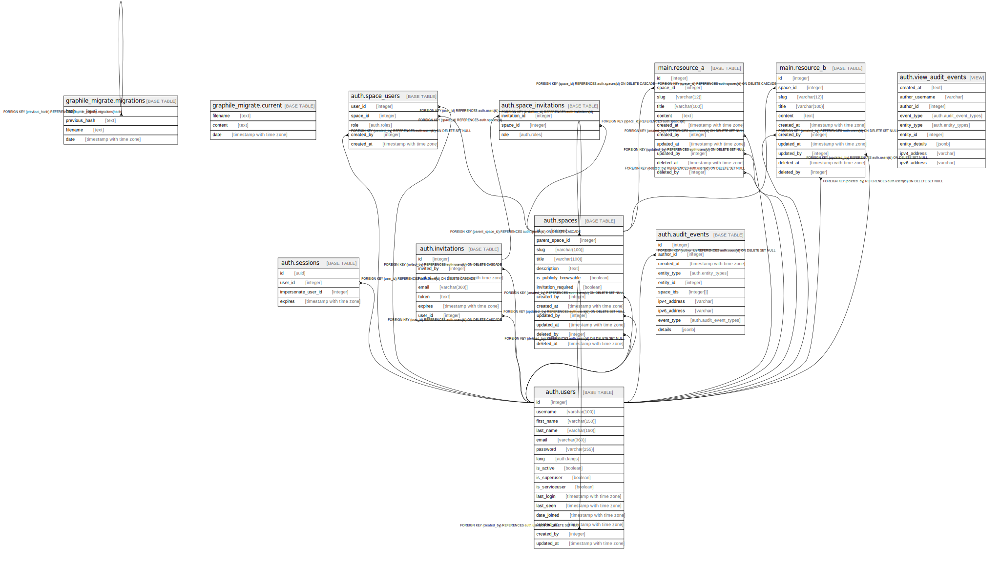

# myapp

## Tables

| Name | Columns | Comment | Type |
| ---- | ------- | ------- | ---- |
| [graphile_migrate.migrations](graphile_migrate.migrations.md) | 4 |  | BASE TABLE |
| [graphile_migrate.current](graphile_migrate.current.md) | 3 |  | BASE TABLE |
| [auth.users](auth.users.md) | 16 |  | BASE TABLE |
| [auth.sessions](auth.sessions.md) | 4 |  | BASE TABLE |
| [auth.spaces](auth.spaces.md) | 13 |  | BASE TABLE |
| [auth.space_users](auth.space_users.md) | 5 |  | BASE TABLE |
| [auth.invitations](auth.invitations.md) | 7 |  | BASE TABLE |
| [auth.space_invitations](auth.space_invitations.md) | 3 |  | BASE TABLE |
| [auth.audit_events](auth.audit_events.md) | 10 |  | BASE TABLE |
| [main.resource_a](main.resource_a.md) | 11 |  | BASE TABLE |
| [main.resource_b](main.resource_b.md) | 11 |  | BASE TABLE |
| [auth.view_audit_events](auth.view_audit_events.md) | 9 |  | VIEW |

## Stored procedures and functions

| Name | ReturnType | Arguments | Type |
| ---- | ------- | ------- | ---- |
| utils.uuid_nil | uuid |  | FUNCTION |
| utils.uuid_ns_dns | uuid |  | FUNCTION |
| utils.uuid_ns_url | uuid |  | FUNCTION |
| utils.uuid_ns_oid | uuid |  | FUNCTION |
| utils.uuid_ns_x500 | uuid |  | FUNCTION |
| utils.uuid_generate_v1 | uuid |  | FUNCTION |
| utils.uuid_generate_v1mc | uuid |  | FUNCTION |
| utils.uuid_generate_v3 | uuid | namespace uuid, name text | FUNCTION |
| utils.uuid_generate_v4 | uuid |  | FUNCTION |
| utils.uuid_generate_v5 | uuid | namespace uuid, name text | FUNCTION |
| utils.digest | bytea | text, text | FUNCTION |
| utils.digest | bytea | bytea, text | FUNCTION |
| utils.hmac | bytea | text, text, text | FUNCTION |
| utils.hmac | bytea | bytea, bytea, text | FUNCTION |
| utils.crypt | text | text, text | FUNCTION |
| utils.gen_salt | text | text | FUNCTION |
| utils.gen_salt | text | text, integer | FUNCTION |
| utils.encrypt | bytea | bytea, bytea, text | FUNCTION |
| utils.decrypt | bytea | bytea, bytea, text | FUNCTION |
| utils.encrypt_iv | bytea | bytea, bytea, bytea, text | FUNCTION |
| utils.decrypt_iv | bytea | bytea, bytea, bytea, text | FUNCTION |
| utils.gen_random_bytes | bytea | integer | FUNCTION |
| utils.gen_random_uuid | uuid |  | FUNCTION |
| utils.pgp_sym_encrypt | bytea | text, text | FUNCTION |
| utils.pgp_sym_encrypt_bytea | bytea | bytea, text | FUNCTION |
| utils.pgp_sym_encrypt | bytea | text, text, text | FUNCTION |
| utils.pgp_sym_encrypt_bytea | bytea | bytea, text, text | FUNCTION |
| utils.pgp_sym_decrypt | text | bytea, text | FUNCTION |
| utils.pgp_sym_decrypt_bytea | bytea | bytea, text | FUNCTION |
| utils.pgp_sym_decrypt | text | bytea, text, text | FUNCTION |
| utils.pgp_sym_decrypt_bytea | bytea | bytea, text, text | FUNCTION |
| utils.pgp_pub_encrypt | bytea | text, bytea | FUNCTION |
| utils.pgp_pub_encrypt_bytea | bytea | bytea, bytea | FUNCTION |
| utils.pgp_pub_encrypt | bytea | text, bytea, text | FUNCTION |
| utils.pgp_pub_encrypt_bytea | bytea | bytea, bytea, text | FUNCTION |
| utils.pgp_pub_decrypt | text | bytea, bytea | FUNCTION |
| utils.pgp_pub_decrypt_bytea | bytea | bytea, bytea | FUNCTION |
| utils.pgp_pub_decrypt | text | bytea, bytea, text | FUNCTION |
| utils.pgp_pub_decrypt_bytea | bytea | bytea, bytea, text | FUNCTION |
| utils.pgp_pub_decrypt | text | bytea, bytea, text, text | FUNCTION |
| utils.pgp_pub_decrypt_bytea | bytea | bytea, bytea, text, text | FUNCTION |
| utils.pgp_key_id | text | bytea | FUNCTION |
| utils.armor | text | bytea | FUNCTION |
| utils.armor | text | bytea, text[], text[] | FUNCTION |
| utils.dearmor | bytea | text | FUNCTION |
| utils.pgp_armor_headers | record | text, OUT key text, OUT value text | FUNCTION |
| utils.bqarr_in | query_int | cstring | FUNCTION |
| utils.bqarr_out | cstring | utils.query_int | FUNCTION |
| utils.querytree | text | utils.query_int | FUNCTION |
| utils.boolop | bool | integer[], utils.query_int | FUNCTION |
| utils.rboolop | bool | utils.query_int, integer[] | FUNCTION |
| utils._int_matchsel | float8 | internal, oid, internal, integer | FUNCTION |
| utils._int_contains | bool | integer[], integer[] | FUNCTION |
| utils._int_contained | bool | integer[], integer[] | FUNCTION |
| utils._int_overlap | bool | integer[], integer[] | FUNCTION |
| utils._int_same | bool | integer[], integer[] | FUNCTION |
| utils._int_different | bool | integer[], integer[] | FUNCTION |
| utils._int_union | _int4 | integer[], integer[] | FUNCTION |
| utils._int_inter | _int4 | integer[], integer[] | FUNCTION |
| utils._int_overlap_sel | float8 | internal, oid, internal, integer | FUNCTION |
| utils._int_contains_sel | float8 | internal, oid, internal, integer | FUNCTION |
| utils._int_contained_sel | float8 | internal, oid, internal, integer | FUNCTION |
| utils._int_overlap_joinsel | float8 | internal, oid, internal, smallint, internal | FUNCTION |
| utils._int_contains_joinsel | float8 | internal, oid, internal, smallint, internal | FUNCTION |
| utils._int_contained_joinsel | float8 | internal, oid, internal, smallint, internal | FUNCTION |
| utils.intset | _int4 | integer | FUNCTION |
| utils.icount | int4 | integer[] | FUNCTION |
| utils.sort | _int4 | integer[], text | FUNCTION |
| utils.sort | _int4 | integer[] | FUNCTION |
| utils.sort_asc | _int4 | integer[] | FUNCTION |
| utils.sort_desc | _int4 | integer[] | FUNCTION |
| utils.uniq | _int4 | integer[] | FUNCTION |
| utils.idx | int4 | integer[], integer | FUNCTION |
| utils.subarray | _int4 | integer[], integer, integer | FUNCTION |
| utils.subarray | _int4 | integer[], integer | FUNCTION |
| utils.intarray_push_elem | _int4 | integer[], integer | FUNCTION |
| utils.intarray_push_array | _int4 | integer[], integer[] | FUNCTION |
| utils.intarray_del_elem | _int4 | integer[], integer | FUNCTION |
| utils.intset_union_elem | _int4 | integer[], integer | FUNCTION |
| utils.intset_subtract | _int4 | integer[], integer[] | FUNCTION |
| utils.g_int_consistent | bool | internal, integer[], smallint, oid, internal | FUNCTION |
| utils.g_int_compress | internal | internal | FUNCTION |
| utils.g_int_decompress | internal | internal | FUNCTION |
| utils.g_int_penalty | internal | internal, internal, internal | FUNCTION |
| utils.g_int_picksplit | internal | internal, internal | FUNCTION |
| utils.g_int_union | _int4 | internal, internal | FUNCTION |
| utils.g_int_same | internal | integer[], integer[], internal | FUNCTION |
| utils._intbig_in | intbig_gkey | cstring | FUNCTION |
| utils._intbig_out | cstring | utils.intbig_gkey | FUNCTION |
| utils.g_intbig_consistent | bool | internal, integer[], smallint, oid, internal | FUNCTION |
| utils.g_intbig_compress | internal | internal | FUNCTION |
| utils.g_intbig_decompress | internal | internal | FUNCTION |
| utils.g_intbig_penalty | internal | internal, internal, internal | FUNCTION |
| utils.g_intbig_picksplit | internal | internal, internal | FUNCTION |
| utils.g_intbig_union | intbig_gkey | internal, internal | FUNCTION |
| utils.g_intbig_same | internal | utils.intbig_gkey, utils.intbig_gkey, internal | FUNCTION |
| utils.ginint4_queryextract | internal | integer[], internal, smallint, internal, internal, internal, internal | FUNCTION |
| utils.ginint4_consistent | bool | internal, smallint, integer[], integer, internal, internal, internal, internal | FUNCTION |
| utils.g_int_options | void | internal | FUNCTION |
| utils.g_intbig_options | void | internal | FUNCTION |
| utils.create_role_if_not_exists | text | rolename name | FUNCTION |
| auth.create_session | uuid | input_user_id integer | FUNCTION |
| auth.authenticate | json | input_username character varying, input_email character varying, input_password character varying | FUNCTION |
| auth.create_user | json | _id integer, _username character varying, _first_name character varying, _last_name character varying, _lang auth.langs, _email character varying, _password character varying, _is_active boolean, _is_superuser boolean, _spaces jsonb | FUNCTION |
| auth.fetch_invitation_by_token | invitations | _token text | FUNCTION |
| auth.create_user_from_invitation | json | _id integer, _invitation_id integer, _username character varying, _first_name character varying, _last_name character varying, _email character varying, _password character varying, _is_active boolean | FUNCTION |
| auth.open_session | jsonb | _session_id uuid | FUNCTION |
| auth.close_session | void |  | FUNCTION |
| auth.space_after_insert_row | trigger |  | FUNCTION |
| auth.impersonate | json | _username character varying | FUNCTION |
| auth.exit_impersonate | void |  | FUNCTION |
| auth.logout | void |  | FUNCTION |
| auth.anonymous_user_ask_reset_password | json | _email character varying | FUNCTION |
| auth.anonymous_user_change_password | json | _email character varying, _password character varying | FUNCTION |
| auth.user_change_password | json | _new_password character varying | FUNCTION |
| auth.get_user_by_email | json | _email character varying | FUNCTION |
| main.resource_a_after_insert_row | trigger |  | FUNCTION |
| main.resource_b_after_insert_row | trigger |  | FUNCTION |
| auth.get_entity_details | jsonb | entity_type auth.entity_types, entity_id integer | FUNCTION |

## Relations

---

> Generated by [tbls](https://github.com/k1LoW/tbls)
