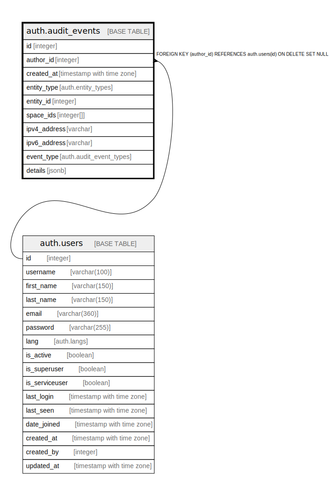

# auth.audit_events

## Description

## Columns

| Name | Type | Default | Nullable | Children | Parents | Comment |
| ---- | ---- | ------- | -------- | -------- | ------- | ------- |
| id | integer | nextval('auth.audit_events_id_seq'::regclass) | false |  |  |  |
| author_id | integer | (NULLIF(current_setting('auth.user_id'::text, true), ''::text))::integer | true |  | [auth.users](auth.users.md) |  |
| created_at | timestamp with time zone | now() | true |  |  |  |
| entity_type | auth.entity_types |  | true |  |  |  |
| entity_id | integer |  | true |  |  |  |
| space_ids | integer[] |  | true |  |  |  |
| ipv4_address | varchar | NULLIF(current_setting('auth.ipv4_address'::text, true), ''::text) | true |  |  |  |
| ipv6_address | varchar | NULLIF(current_setting('auth.ipv6_address'::text, true), ''::text) | true |  |  |  |
| event_type | auth.audit_event_types |  | true |  |  |  |
| details | jsonb |  | true |  |  |  |

## Constraints

| Name | Type | Definition |
| ---- | ---- | ---------- |
| audit_events_author_id_fkey | FOREIGN KEY | FOREIGN KEY (author_id) REFERENCES auth.users(id) ON DELETE SET NULL |
| audit_events_pkey | PRIMARY KEY | PRIMARY KEY (id) |

## Indexes

| Name | Definition |
| ---- | ---------- |
| audit_events_pkey | CREATE UNIQUE INDEX audit_events_pkey ON auth.audit_events USING btree (id) |
| audit_events_author_id_index | CREATE INDEX audit_events_author_id_index ON auth.audit_events USING btree (author_id) |
| audit_events_created_at_index | CREATE INDEX audit_events_created_at_index ON auth.audit_events USING btree (created_at) |
| audit_events_entity_type_index | CREATE INDEX audit_events_entity_type_index ON auth.audit_events USING btree (entity_type) |
| audit_events_entity_id_index | CREATE INDEX audit_events_entity_id_index ON auth.audit_events USING btree (entity_id) |
| audit_events_space_ids_index | CREATE INDEX audit_events_space_ids_index ON auth.audit_events USING gist (space_ids) |
| audit_events_ipv4_address_index | CREATE INDEX audit_events_ipv4_address_index ON auth.audit_events USING btree (ipv4_address) |
| audit_events_ipv6_address_index | CREATE INDEX audit_events_ipv6_address_index ON auth.audit_events USING btree (ipv6_address) |
| audit_events_event_type_index | CREATE INDEX audit_events_event_type_index ON auth.audit_events USING btree (event_type) |

## Relations

---

> Generated by [tbls](https://github.com/k1LoW/tbls)
