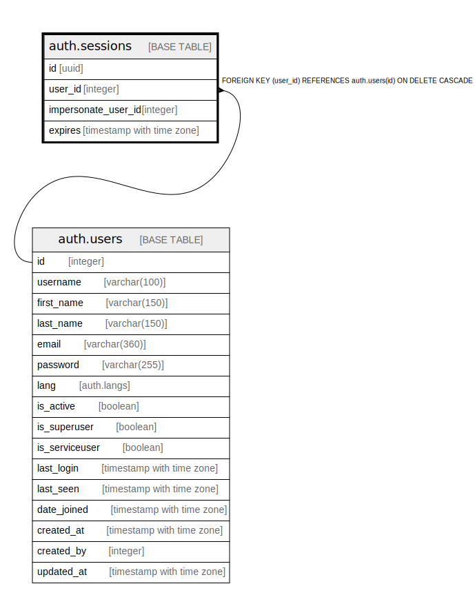

# auth.sessions

## Description

## Columns

| Name | Type | Default | Nullable | Children | Parents | Comment |
| ---- | ---- | ------- | -------- | -------- | ------- | ------- |
| id | uuid | utils.uuid_generate_v4() | false |  |  |  |
| user_id | integer |  | false |  | [auth.users](auth.users.md) |  |
| impersonate_user_id | integer |  | true |  |  |  |
| expires | timestamp with time zone | (CURRENT_TIMESTAMP + '2 days'::interval) | true |  |  |  |

## Constraints

| Name | Type | Definition |
| ---- | ---- | ---------- |
| fk_user_id | FOREIGN KEY | FOREIGN KEY (user_id) REFERENCES auth.users(id) ON DELETE CASCADE |
| sessions_pkey | PRIMARY KEY | PRIMARY KEY (id) |

## Indexes

| Name | Definition |
| ---- | ---------- |
| sessions_pkey | CREATE UNIQUE INDEX sessions_pkey ON auth.sessions USING btree (id) |
| sessions_user_id_index | CREATE INDEX sessions_user_id_index ON auth.sessions USING btree (user_id) |
| sessions_impersonate_user_id_index | CREATE INDEX sessions_impersonate_user_id_index ON auth.sessions USING btree (impersonate_user_id) |

## Relations

---

> Generated by [tbls](https://github.com/k1LoW/tbls)
