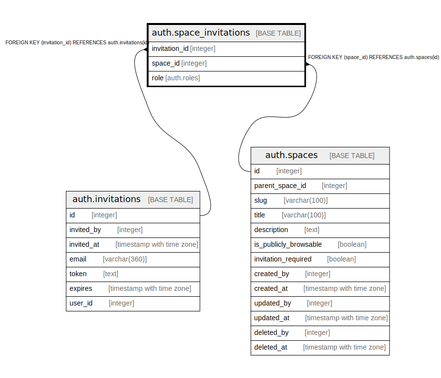

# auth.space_invitations

## Description

## Columns

| Name | Type | Default | Nullable | Children | Parents | Comment |
| ---- | ---- | ------- | -------- | -------- | ------- | ------- |
| invitation_id | integer |  | false |  | [auth.invitations](auth.invitations.md) |  |
| space_id | integer |  | false |  | [auth.spaces](auth.spaces.md) |  |
| role | auth.roles |  | false |  |  |  |

## Constraints

| Name | Type | Definition |
| ---- | ---- | ---------- |
| space_invitations_space_id_fkey | FOREIGN KEY | FOREIGN KEY (space_id) REFERENCES auth.spaces(id) |
| space_invitations_invitation_id_fkey | FOREIGN KEY | FOREIGN KEY (invitation_id) REFERENCES auth.invitations(id) |

## Indexes

| Name | Definition |
| ---- | ---------- |
| space_invitations_invitation_id_index | CREATE INDEX space_invitations_invitation_id_index ON auth.space_invitations USING btree (invitation_id) |
| space_invitations_space_id_index | CREATE INDEX space_invitations_space_id_index ON auth.space_invitations USING btree (space_id) |
| space_invitations_role_index | CREATE INDEX space_invitations_role_index ON auth.space_invitations USING btree (role) |

## Relations

---

> Generated by [tbls](https://github.com/k1LoW/tbls)
