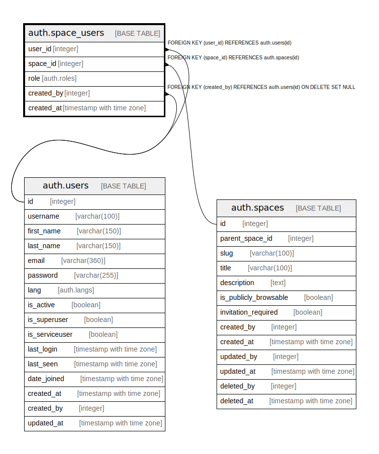

# auth.space_users

## Description

## Columns

| Name | Type | Default | Nullable | Children | Parents | Comment |
| ---- | ---- | ------- | -------- | -------- | ------- | ------- |
| user_id | integer |  | false |  | [auth.users](auth.users.md) |  |
| space_id | integer |  | false |  | [auth.spaces](auth.spaces.md) |  |
| role | auth.roles |  | false |  |  |  |
| created_by | integer | (NULLIF(current_setting('auth.user_id'::text, true), ''::text))::integer | true |  | [auth.users](auth.users.md) |  |
| created_at | timestamp with time zone | now() | true |  |  |  |

## Constraints

| Name | Type | Definition |
| ---- | ---- | ---------- |
| space_users_created_by_fkey | FOREIGN KEY | FOREIGN KEY (created_by) REFERENCES auth.users(id) ON DELETE SET NULL |
| space_users_user_id_fkey | FOREIGN KEY | FOREIGN KEY (user_id) REFERENCES auth.users(id) |
| space_users_space_id_fkey | FOREIGN KEY | FOREIGN KEY (space_id) REFERENCES auth.spaces(id) |

## Indexes

| Name | Definition |
| ---- | ---------- |
| space_users_user_id_index | CREATE INDEX space_users_user_id_index ON auth.space_users USING btree (user_id) |
| space_users_space_id_index | CREATE INDEX space_users_space_id_index ON auth.space_users USING btree (space_id) |
| space_users_role_index | CREATE INDEX space_users_role_index ON auth.space_users USING btree (role) |
| space_users_created_by_index | CREATE INDEX space_users_created_by_index ON auth.space_users USING btree (created_by) |
| space_users_created_at_index | CREATE INDEX space_users_created_at_index ON auth.space_users USING btree (created_at) |

## Relations

---

> Generated by [tbls](https://github.com/k1LoW/tbls)
