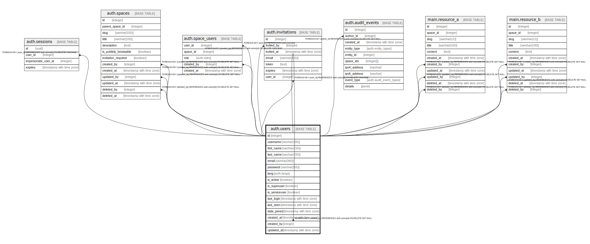

# auth.users

## Description

## Columns

| Name | Type | Default | Nullable | Children | Parents | Comment |
| ---- | ---- | ------- | -------- | -------- | ------- | ------- |
| id | integer | nextval('auth.users_id_seq'::regclass) | false | [auth.users](auth.users.md) [auth.sessions](auth.sessions.md) [auth.spaces](auth.spaces.md) [auth.space_users](auth.space_users.md) [auth.invitations](auth.invitations.md) [auth.audit_events](auth.audit_events.md) [main.resource_a](main.resource_a.md) [main.resource_b](main.resource_b.md) |  |  |
| username | varchar(100) |  | false |  |  |  |
| first_name | varchar(150) | NULL::character varying | true |  |  |  |
| last_name | varchar(150) | NULL::character varying | true |  |  |  |
| email | varchar(360) |  | false |  |  |  |
| password | varchar(255) |  | false |  |  |  |
| lang | auth.langs | 'EN'::auth.langs | false |  |  |  |
| is_active | boolean | false | true |  |  |  |
| is_superuser | boolean | false | true |  |  |  |
| is_serviceuser | boolean | false | true |  |  |  |
| last_login | timestamp with time zone |  | true |  |  |  |
| last_seen | timestamp with time zone |  | true |  |  |  |
| date_joined | timestamp with time zone |  | true |  |  |  |
| created_at | timestamp with time zone | now() | true |  |  |  |
| created_by | integer | (NULLIF(current_setting('auth.user_id'::text, true), ''::text))::integer | true |  | [auth.users](auth.users.md) |  |
| updated_at | timestamp with time zone | now() | true |  |  |  |

## Constraints

| Name | Type | Definition |
| ---- | ---- | ---------- |
| users_created_by_fkey | FOREIGN KEY | FOREIGN KEY (created_by) REFERENCES auth.users(id) ON DELETE SET NULL |
| users_pkey | PRIMARY KEY | PRIMARY KEY (id) |
| users_username_key | UNIQUE | UNIQUE (username) |
| users_email_key | UNIQUE | UNIQUE (email) |

## Indexes

| Name | Definition |
| ---- | ---------- |
| users_pkey | CREATE UNIQUE INDEX users_pkey ON auth.users USING btree (id) |
| users_username_key | CREATE UNIQUE INDEX users_username_key ON auth.users USING btree (username) |
| users_email_key | CREATE UNIQUE INDEX users_email_key ON auth.users USING btree (email) |
| users_username_index | CREATE INDEX users_username_index ON auth.users USING btree (username) |
| users_first_name_index | CREATE INDEX users_first_name_index ON auth.users USING btree (first_name) |
| users_last_name_index | CREATE INDEX users_last_name_index ON auth.users USING btree (last_name) |
| users_email_index | CREATE INDEX users_email_index ON auth.users USING btree (email) |
| users_is_active_index | CREATE INDEX users_is_active_index ON auth.users USING btree (is_active) |
| users_last_login_index | CREATE INDEX users_last_login_index ON auth.users USING btree (last_login) |
| users_last_seen_index | CREATE INDEX users_last_seen_index ON auth.users USING btree (last_seen) |
| users_date_joined_index | CREATE INDEX users_date_joined_index ON auth.users USING btree (date_joined) |
| users_created_at_index | CREATE INDEX users_created_at_index ON auth.users USING btree (created_at) |
| users_updated_at_index | CREATE INDEX users_updated_at_index ON auth.users USING btree (updated_at) |

## Relations

---

> Generated by [tbls](https://github.com/k1LoW/tbls)
