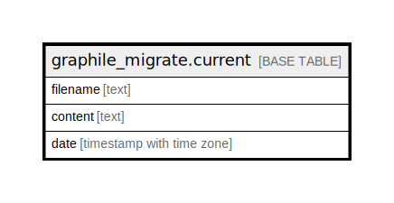

# graphile_migrate.current

## Description

## Columns

| Name | Type | Default | Nullable | Children | Parents | Comment |
| ---- | ---- | ------- | -------- | -------- | ------- | ------- |
| filename | text | 'current.sql'::text | false |  |  |  |
| content | text |  | false |  |  |  |
| date | timestamp with time zone | now() | false |  |  |  |

## Constraints

| Name | Type | Definition |
| ---- | ---- | ---------- |
| current_pkey | PRIMARY KEY | PRIMARY KEY (filename) |

## Indexes

| Name | Definition |
| ---- | ---------- |
| current_pkey | CREATE UNIQUE INDEX current_pkey ON graphile_migrate.current USING btree (filename) |

## Relations

---

> Generated by [tbls](https://github.com/k1LoW/tbls)
