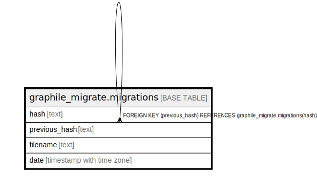

# graphile_migrate.migrations

## Description

## Columns

| Name | Type | Default | Nullable | Children | Parents | Comment |
| ---- | ---- | ------- | -------- | -------- | ------- | ------- |
| hash | text |  | false | [graphile_migrate.migrations](graphile_migrate.migrations.md) |  |  |
| previous_hash | text |  | true |  | [graphile_migrate.migrations](graphile_migrate.migrations.md) |  |
| filename | text |  | false |  |  |  |
| date | timestamp with time zone | now() | false |  |  |  |

## Constraints

| Name | Type | Definition |
| ---- | ---- | ---------- |
| migrations_pkey | PRIMARY KEY | PRIMARY KEY (hash) |
| migrations_previous_hash_fkey | FOREIGN KEY | FOREIGN KEY (previous_hash) REFERENCES graphile_migrate.migrations(hash) |

## Indexes

| Name | Definition |
| ---- | ---------- |
| migrations_pkey | CREATE UNIQUE INDEX migrations_pkey ON graphile_migrate.migrations USING btree (hash) |

## Relations

---

> Generated by [tbls](https://github.com/k1LoW/tbls)
